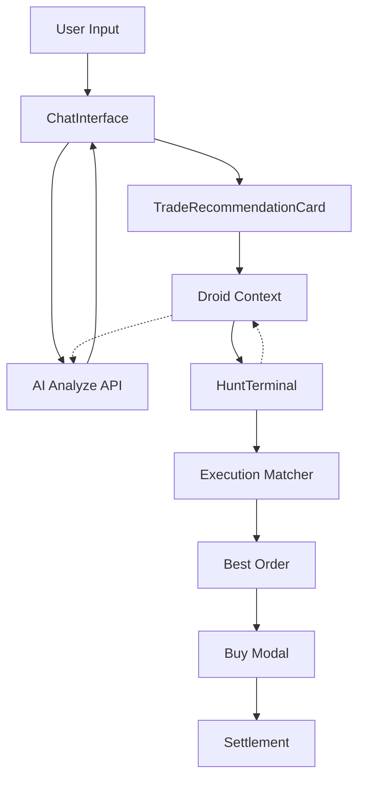

# Alphabit Abstraction Layer

## Overview
Alphabit turns complex DeFi options into an arcade-style experience. Core abstractions:
- **Game-first terms** (Moon/Doom, Blitz/Core) replace options jargon.
- **Intent-based execution** auto-picks the best order from Thetanuts RFQ.
- **Tactical Droid (R.O.B.B.I.E. 9000)** is the AI copilot that converts chat into structured trade intent.
- **Optimistic UX** keeps interactions instant even while on-chain settlement confirms.

## Core Abstractions
- **Direction & Asset**  
  - Moon = Call, Doom = Put.  
  - Asset switcher limited to `ETH`/`BTC` to keep RFQ stable.
- **Duration → Expiry Bucket**  
  - Blitz = 2–9h, Rush = 9–18h, Core = 18–36h, Orbit = >36h.  
  - `filterOrdersByDuration` maps buckets to the nearest expiry.
- **Greeks → Game Stats**

| Financial Metric | Game Stat | Explanation |
| :--- | :--- | :--- |
| Delta | Power Level | ITM probability surfaced as “signal strength.” |
| Theta | Decay Timer | Time decay shown as a countdown. |
| Gamma | Volatility | “Critical hit” / spike likelihood. |
| Strike | Target | Price level to hit. |
| Premium | Entry Cost | Cost to join the round. |

- **Collateral → Shields**  
  Collateral slider = USDC committed per mission. Gamification (Missions/XP) does not alter payoff; UX only.
- **Auto-Best vs Manual**  
  - Auto-Best uses the matcher’s best order.  
  - Manual Matrix opens `OrderMatrix` to pick a specific strike without leaving the “game.”

## Execution Matcher
Logic lives in `hooks/useThetanutsOrders.ts` and is consumed in `HuntTerminal`.
1) **Query RFQ**: fetch all orders via backend proxy.  
2) **Intent filter**: target (Moon/Doom), asset, and duration bucket.  
3) **Best Fit**: `getBestOrder` favors lowest premium / best ROI.  
4) **Trade Intent Injection**: when AI emits `tradeIntent`, terminal:
   - Sync asset/duration/target.
   - If provided, match nearest strike.
   - Fallback to best order and open `BuyModal`.
- **Arcade Picker (Simplified)**: uses Thetanuts RFQ and auto-picks the closest OTM/ATM strike to spot price (Calls: strike ≥ spot, Puts: strike ≤ spot). Falls back to closest available strike if no OTM/ATM liquidity exists.

## Optimistic Settlement (Blitz Mode)
- “Trade Active” state appears once TX hash exists while polling for confirmation.  
- Reduces perceived lag without sacrificing on-chain accuracy.

## Tactical Droid (AI Copilot)
Purpose: bridge chat → trade action without forcing users to learn options.

- **State & Profiling** (`context/DroidContext.tsx`)
  - RiskProfile (SAFE/DEGEN) & Timeline (SHORT/LONG) saved to `localStorage`.
  - Market snapshot (price, change, sentiment) synced from `useOraclePrice` via `updateMarketData`.
  - TradeIntent drives modal activation in the terminal.

- **Brain & Persona**
  - System prompt: `lib/groq.ts` (R.O.B.B.I.E. 9000 persona).  
  - API route: `app/api/ai/analyze/route.ts` forwards chat + marketData to Groq.  
  - Model is instructed to append JSON `{"REC_DATA": {...}}` at the end when a clear recommendation exists.

- **Conversation Layer** (`components/droid/ChatInterface.tsx`)
  - Renders markdown + 3-question micro-survey (loss aversion, time preference, goal) → `riskEngine`.
  - Parses recommendation JSON into `TradeRecommendationCard`; “INITIATE SEQUENCE” triggers `triggerTrade`.
  - Quick chips (“Scan ETH”, “Market Sentiment”) keep the arcade loop fast.

- **HUD Bubble** (`components/features/TacticalDroid.tsx`)
  - `useTacticalBrain` produces short dialog based on Call/Put volume & spread.  
  - Tutorial mode swaps market chatter with step-by-step onboarding.

## Data/Intent Flow

## Quick Extensions
- Add a new asset: update `useThetanutsOrders`, `HuntTerminal` selector, and sentiment/price feed mapping.  
- Add a new duration bucket: update the table above and `filterOrdersByDuration`.  
- Adjust persona/safety tone: edit `DROID_SYSTEM_PROMPT` to reiterate “not financial advice.”  
- No-AI mode: skip `DroidProvider` in `app/rootProvider.tsx` if a minimal static build is needed.
